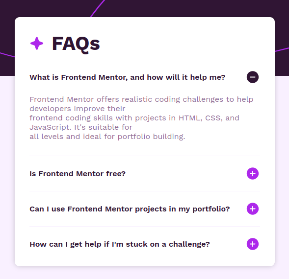

# Frontend Mentor - Social links profile solution

Esta é uma solução para o desafio da criação de uma FAQ no 
 [Frontend Mentor](https://www.frontendmentor.io/challenges/faq-accordion-wyfFdeBwBz). Os desafios do Frontend mentor ajudam você a melhorar as suas habilidades de programação através da construção de projetos realísticos.

## Tabela de conteúdos

- [Visão geral](#visão-geral)
  - [O desafio](#o-desafio)
  - [Imagem do projeto feito](#imagem-do-projeto-feito)
  - [Links](#links)
- [Construído com](#construído-com)
- [Autor](#autor)

##  Visão Geral

## O desafio

Basicamente, o desafio consistia em construir uma FAQ (perguntas frequentes) da maneira mais semelhante possível ao modelo que foi sugerido.

### Imagem do projeto feito

### Links

- Solução URL: [URL da solução](https://github.com/moisesferreira123/faq-accordion-project)
- Live Site URL: [Live site URL](https://moisesferreira123.github.io/faq-accordion-project/)

## Construído com

- HTML5
- CSS
- JavaScript
- Visual Studio Code

## Autor

- Frontend Mentor - [@moisesferreira123](https://www.frontendmentor.io/profile/moisesferreira123)
- GitHub - [@moisesferreira123](https://github.com/moisesferreira123)
